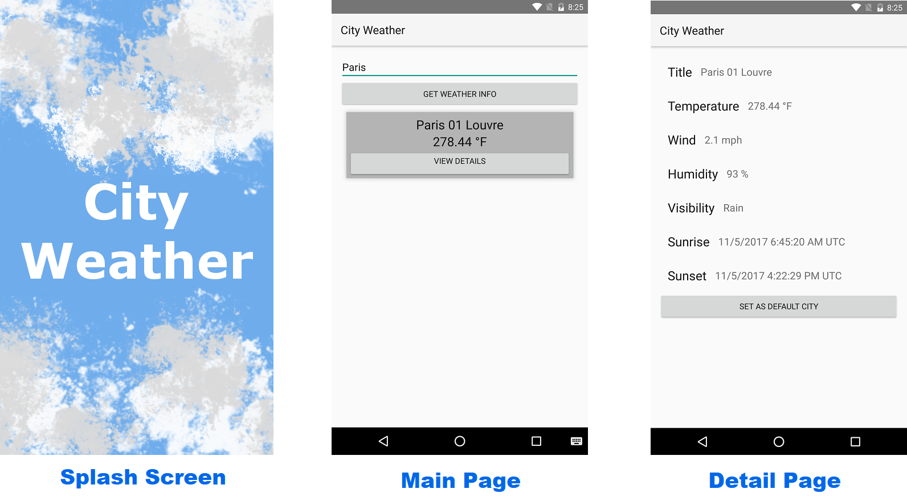

<h1 align="center"> City Weather </h1>  

Cross-platform Xamarin Native application that shows weather
information in cities using the
 [Open Weather API](http://openweathermap.org/current).

## Screen Shots

## Projects
### CityWeather.Core
  Shared backend services, __Models__, and [MVVMCross](https://www.mvvmcross.com/documentation/) __ViewModels__
### CityWeather.Droid
  Android platform specific frontend [MVVMCross](https://www.mvvmcross.com/documentation/) __Views__
### CityWeather.Touch
  iOS platform specific frontend [MVVMCross](https://www.mvvmcross.com/documentation/) __Views__

  __Mostly completed, where I don't own iOS devices to test__
### CityWeather.Test
  [NUnit](http://nunit.org/documentation/) TDD tests for the __CityWeather.Core__ project
### CityWeather.Specs
  [Specflow](http://specflow.org/docs/) BDD feature tests

## Author
  * [Egill Anton Hlöðversson](https://github.com/egillanton) - Xamarin Developer

# License
This project is licensed under the MIT License - see the [LICENSE.md](./doc/LICENSE.md) file for details
